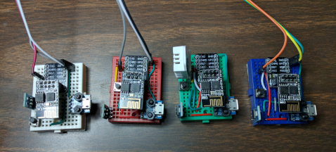

# esp8266-dht-udp

A temperature and humidity sensor using a DHT22/11 device and UDP to transmit the data to a server.

- [History](#history)
- [Overview](#overview)
- [Details](#details)
  * [Operation](#operation)
    + [Network Traffic](#network-traffic)
      - [Data Messages](#data-messages)
      - [Status Messages](#status-messages)
      - [Device Heartbeat](#device-heartbeat)
  * [Configuration](#configuration)
    + [File Naming Convention](#file-naming-convention)
    + [Application Configuration](#application-configuration)
    + [WiFi Configuration](#wifi-configuration)
    + [UDP Client Configuration](#udp-client-configuration)
    + [Alternative UDP Client Configuration](#alternative-udp-client-configuration)
    + [Multi-cast UDP Configuration](#multi-cast-udp-configuration)
    + [Device Mimic](#device-mimic)
    + [Sensor Configuration](#sensor-configuration)
  * [OTA](#ota)
    + [Configuration](#configuration-1)
  * [Schematic and Build Details](#schematic-and-build-details)
    + [Finished Sensor Devices](#finished-sensor-devices)
    + [Parts List and Sources](#parts-list-and-sources)
  * [DHTxx Library Modifications](#dhtxx-library-modifications)
- [Future Modifications](#future-modifications)
  * [Application Version](#application-version)
  * [Configuration File Naming](#configuration-file-naming)
  * [Run-time Configuration](#run-time-configuration)

<small><i><a href='http://ecotrust-canada.github.io/markdown-toc/'>Table of contents generated with markdown-toc</a></i></small>

# History

I had been tinkering with using an ESP8266 and a temperature/humidity sensor to record data within my home. I hadn't really moved forward with it until the end of December 2017. And what really prompted me to move forward with the project was the brutally cold temperatures we experienced in Chicago. I was concerned about water pipes freezing, or my furnace breaking down. So the completion of this project (*sensors, server, database, and web client*) became *very* important. Fortunately no pipes froze, and my furnace continued working! I was luckier than some of my neighbors!

# Overview

Each *sensor device* consists of an ESP-01S and a DHT22 temperature/humidity sensor. However most any ESP8266 platform should work.

The operation of the devices are configurable and utilize UDP to communicate status and data to a server implemented to run on NodeJS.

# Details

## Operation

This application requires a server capable of receiving UDP packets. I've chosen NodeJS for this, and a server can be found in my [node-dht-udp](https://github.com/jxmot/node-dht-udp) repository.

It is the responsibility of that server to listen for data from the sensors and forward it to a database and to any connected *web clients*.

### Network Traffic

The devices transmit two types of UDP traffic, *multi-cast UDP* and *UDP*. The multi-cast messages are intended for communicating device status to one or more listeners. The other messages are sent to a specific server and contain sensor data.

#### Data Messages

Here's an example of a typical data message - 

* Device Sensor Data - `{"dev_id":"ESP_49ECF6","seq":2,"t":67.28,"h":26.20}`
    * **`dev_id`** - The ID of the device, for the ESP8266 devices this is typically the _network ID_ of the ESP8266.
    * **`seq`** - This sequence number is incremented every time the DHT-XX is queried for data. There _can be_ gaps in the sequence and it indicates that a reading has occurred but the amount of change was not sufficient to send a message. The _server_ can use it to aid in interpolation of values between readings, and for smoothing out graphs.
    * **`t`** - The temperature in the scale (_F or C_) that was configured.
    * **`h`** - The relative humidity

#### Status Messages

Here are some examples of the status messages that a sensor device might send - 

* Device successful start - `{"dev_id":"ESP_49ECF6","status":"APP_READY"}`
* Device sensor error - `{"dev_id":"ESP_49ECF6","status":"SENSOR_ERROR","msg":"Too many NaN readings from sensor"}`
* Device sensor recovery - `{"dev_id":"ESP_49ECF6","status":"SENSOR_RECOVER","msg":"Recovered after NaN from sensor"}`

#### Device Heartbeat

The primary purpose of the heartbeat is enhance the monitoring of the state of a sensor device. A heartbeat will occur when the temperature and humidity have not changed more than their delta for a period of time. 

The period of time that will pass between heartbeats is the *sensor read interval* times 4. For example, if the DHT-XX device is read every 5 minutes a heartbeat will occur every 20 minutes unless a data message is sent. The transmission of a data message will reset the heartbeat interval counter.

There are several messages associated with the heartbeat - 

* Heart Rate Announcement - `{"dev_id":"ESP_49ECF6","status":"HEART","msg":"heartbeats @ 5 min(300000ms)"}`
    * Only sent once during start up & initialization. 
* Heartbeat Pulse - `{"dev_id":"ESP_49ECF6","status":"TICK" | "TOCK","msg":"beatcount = 5"}`
    * The `status` will alternate between `TICK` and `TOCK` each time the message is sent. The `beatcount` value is a counter of how many heartbeats have occurred to that point. **_This is an optional message, and it is typically disabled. To enable it change the value of_ `esp8266-dht-udp.ino:sendbeat` _to_ `true`_._**
* Heartbeat Sensor Data - `{"dev_id":"ESP_49ECF6","seq":1539,"t":59.72,"h":35.70,"last":{"t":60.08,"h":36.20}}`
    * Sent when a heartbeat occurs. There are two sets of temperature & humidity values. The first is the _current_ reading directly from the DHT-XX sensor. And the second, in the `last` object are the values that were sent in the last data message that was sent before the heartbeat.
    
**NOTE :** The heartbeat can be disabled by commenting out `#define HEARTBEAT` in `esp8266-dht-udp.ino`.

## Configuration

The configuration source code is based on my [ESP8266-config-data-V2](<https://github.com/jxmot/ESP8266-config-data-V2>) repository. Therefore only the configurable items and their use will be described here.

The configuration files are kept in the `data` folder.

### File Naming Convention

Some configuration files may contain *sensitive* information that should not be placed into a public repository. In order to prevent them from getting into the repository their filenames begin with an underscore. This is accomplished with an entry in this repository's `.gitignore` file. However there are example configuration files provided that to not have the underscore in their names.

### Application Configuration

This file is the first configuration file read by the application. It provides a location where the remaining configuration files are listed. It also contains the *application name*, and a boolean value for enabling or disabling run-time output to the serial port. Here are the contents of the sample `appcfg.dat` file -

```json
{
    "appname":"Your App Name Here",
    "debugmute":false,
    "wificonfig":"/wificfg.dat",
    "clientconfig":"/clientcfg.dat",
    "mcastconfig":"/multicfg.dat",
    "sensorconfig":"/sensorcfg.dat"
}
```

To keep the contents of this file secure make a copy of it and prepend the underscore to its name. 

### WiFi Configuration

The `data/wificfg.dat` file contains one or more WiFi SSIDs and passwords. Here are the contents of the sample `wificfg.dat` file -

```json
{ "apoints":[
{"ssid":"your ssid-1 here","pass":"your wifi password-1 here"},
{"ssid":"your ssid-2 here","pass":"your wifi password-2 here"}
],"apcount":2}
```

The code responsible for connecting to an access point will multiple attempts. This is described in the README of the [ESP8266-config-data-V2](<https://github.com/jxmot/ESP8266-config-data-V2>) repository. 

To keep the contents of this file secure make a copy of it and prepend the underscore to its name. Be sure to edit your `data/_appcfg.data` file to access the correct file.

### UDP Client Configuration

The `data/clientcfg.dat` file contains one or more entries that each contain the IP address and port number of a UDP enabled server that the application can access. Here are the contents of the sample `clientcfg.dat` file -

```json
{
"udp1":{"addr":"server IP address","port":54321},
"udp2":{"addr":"server IP address","port":54321}
}
```

The server is chosen in `esp8266-udp.cpp`, `initUDP()`. Edit this line - 

```c++
if(c_cfgdat->getServer("udp1", udpClient)) success = true;
```

and change `"udp1"` to a different string as needed.

The chosen configuration data is read and parsed into the `esp8266-udp.cpp:udpClient` object.  

To keep the contents of this file secure make a copy of it and prepend the underscore to its name. Be sure to edit your `data/_appcfg.data` file to access the correct file.

### Alternative UDP Client Configuration

The device has the ability to request the server's IP address and port number that it uses for UDP messages. It accomplishes this by broadcasting a `REQ_IP` status message. When received by the server it will respond directly to the device with its UDP address information.

After the device receives the server's reply it will parse it into `esp8266-udp.cpp:udpClient` and over write any values set when the `data/clientcfg.dat` file was read and parsed.

**NOTE :** This can be disabled by commenting out the line `#define QUERY_SERVER` in `esp8266-ino.cpp`.

### Multi-cast UDP Configuration

The `data/multicfg.dat` file contains the IP address and port number for the intended multi-cast destination. Here are the contents of the file -

```json
{
    "addr":"224.0.0.1",
    "port":54321
}
```

This file does not contain sensitive configuration data. So it is not necessary to prepend the underscore to its name.

### Device Mimic

The mimic feature is used for allowing for the replacement of a failed device with a new one, and having the new device "mimic" the `hostname` and device ID of the one it replaced. This become useful when there is a large amount of data that's been collected(*server side*) and it's indexed on the device ID.

To enable mimic for a device:

1. create a file named `_device_id.json`, where **`device_id`** is the ID of the current device.
**NOTE:** The file name **must** begin with an underscore "_"! For example `_ESP_BEEFEE.json`.

2. edit the file and add:
```
{
"mimic": "ESP_12AB34"
}
```

Where `"ESP_12AB34"` is the hostname of the device that is being replaced.

3. save the file and upload to the device

4. when the sketch runs it will look for a json file where it's own id is in in the file name. If found it will take the ID from the file and replace it's current ID. It will use that ID when sending statuses and data. 

### Sensor Configuration

Here are the contents of the `sensorcfg.dat` file -

```json
{
    "type":"DHT22",
    "pin":"D6",
    "scale":"F",
    "interval":300000,
    "error_interval":10000,
    "report":"CHG",
    "delta_t": 5,
    "delta_h": 10
}
```

The `data/sensorcfg.dat` file contains the configure the application for one of two specific temperature/humdity sensors - 

* **`type`** - Sensor type, either `"DHT11"` or `"DHT22"`. At this time these are the only sensors supported.
* **`pin`** - EPS8266 pin number, this is the pin number of the ESP8266 that is used for communication with the DHT sensor. 
    * **NOTE** : This pin setting is ignored if an ESP-01 is used. On that platform GPIO2 will be used instead and is not configurable. See `sensor-dht.cpp` and look for `ARDUINO_ESP8266_ESP01` for the associated code.
* **`scale`** - Temperature scale, this is used to select **F**ahrenheit or **C**elsius.
* **`interval`** - Sensor reading interval, this is the duration in milliseconds between subsequent sensor data readings.
* **`error_interval`** - Sensor retry interval, this is the duration in milliseconds between subsequent sensor data readings when an error (*typically the sensor will return NaN*) occurs.
* **`report`** - Reporting type, the current choices are `"ALL"` or `"CHG"`. Their meanings are - 
    * `"ALL"` - report the sensor data *every time* the sensor data is read.
    * `"CHG"` - only report sensor data *if* the temperature or humidity values have changed.
* **`delta_t`** & **`delta_h`** - If the reporting type is `"CHG"` then this is the amount of required change before the temperature or humidity are reported. The integer value kept here is divided by 10 to create a floating point value. Then if the amount of change (*temperature or humidity*) is greater then the data is sent.


This file does not contain sensitive configuration data. So it is not necessary to prepend the underscore to its name.

## OTA

I experimented with OTA with limited results. And the device would not appear reliably in the Arduino IDE. So it has been disabled. To enable OTA remove the comment on the line `//#define USE_OTA` in `esp8266-dht-udp.ino`.

### Configuration

The OTA configuration is located in `data/otacfg.dat`. At this time only the `otadur` is used. It is the amount of time that the device will wait for OTA to begin *before* it starts the application.

## Schematic and Build Details

**schematic goes here**

### Finished Sensor Devices

<p align="center">
  
</p>


### Parts List and Sources

I usually don't like to wait very long for parts and components, so I normally use Amazon as my supplier. (*The links below connect to Amazon*)

* [Elegoo 6PCS 170 tie-points Mini Breadboard kit for Arduino](<https://www.amazon.com/dp/B01EV6SBXQ/_encoding=UTF8?coliid=I2ITWEX69IO04P&colid=1JJSTU3ZZ46WB&psc=0>)
* [MagiDeal 10pcs Female MICRO USB to DIP 5-Pin Pinboard 2.54mm micro USB type](<https://www.amazon.com/dp/B0183KF7TM/_encoding=UTF8?coliid=I2F21T0Z4T8FSA&colid=1JJSTU3ZZ46WB&psc=0>)
* [ICstation AMS1117-3.3 DC Voltage Regulator Step Down Power Supply Module 4.75V-12V to 3.3V 800mA (Pack of 5)](<https://www.amazon.com/dp/B01N1I1LXH/_encoding=UTF8?coliid=I1QLGRVNPEC9BW&colid=1JJSTU3ZZ46WB&psc=0>)
* [MakerSpot 6mm 2 Pin Panel PCB Momentary Tactile Tact Push Button Switch Through Hole Breadboard Friendly x 10 pack](<https://www.amazon.com/dp/B06XT3FLVM/_encoding=UTF8?coliid=IHDJ17G87T353&colid=1JJSTU3ZZ46WB&psc=1>)
* [DIYmall ESP8266 ESP-01 ESP-01S Breakout Board Breadboard Adapter PCB for Serial Wifi Transceiver Network(pack of 5pcs)](<https://www.amazon.com/dp/B01G6HK3KW/_encoding=UTF8?coliid=I3PB0CYDQEKKIR&colid=1JJSTU3ZZ46WB&psc=0>)
* [Makerfocus 4pcs ESP8266 ESP-01S WiFi Serial Transceiver Module with 1MB Flash for Arduino](<https://www.amazon.com/dp/B01N98BTRH/_encoding=UTF8?coliid=I39GX8UJJRCBZR&colid=1JJSTU3ZZ46WB&psc=0>)
* Sensor choices - 
    * [Gowoops 2 PCS DHT22 Temperature Humidity Sensor Module Digital Measurement for Arduino Raspberry Pi 2 3](<https://www.amazon.com/dp/B073F472JL/_encoding=UTF8?coliid=IMAZ5Q0HI2VAY&colid=1JJSTU3ZZ46WB&psc=0>)
    * [HiLetgo 1pc DHT22/AM2302 Digital Temperature And Humidity Sensor Module Temperature Humidity Monitor Sensor Replace SHT11 SHT15 for Arduino Electronic Practice DIY](https://www.amazon.com/dp/B01N9BA0O4/_encoding=UTF8?coliid=IUEZTEIDN7FXF&colid=1JJSTU3ZZ46WB&psc=1)
    * [WINGONEER 5PCS of Temperature Humidity Sensor Module Digital DHT11 for Arduino Raspberry Pi 2 3](<https://www.amazon.com/WINGONEER-Temperature-Humidity-Digital-Raspberry/dp/B06XHJ1BPC/ref=sr_1_2?s=electronics&ie=UTF8&qid=1517210078&sr=1-2&keywords=DHT11>)
* Power Supply - 
    * [Wall Charger Abosi 3 Pack 5V 1A UL Certified Universal Power Adapter USB 1 Port Home Wall Charger Plug Compatible with iPhone Samsung and More Device UL Listed (AB-65)](<https://www.amazon.com/gp/product/B076C6PW2V/ref=oh_aui_detailpage_o02_s00?ie=UTF8&th=1>)
    * [Rankie 3-Pack 3ft Micro USB Cable High Speed Data and Charging (Black)](<https://www.amazon.com/gp/product/B00UFG5GVM/ref=oh_aui_detailpage_o04_s00?ie=UTF8&psc=1>)

My preference of sensors is the DTH22. It seems to have better accuracy and less drift than the DHT11.

## DHTxx Library Modifications

The following modifications were made to the *Adafruit* DHT source files `src/adafruit/DHT.h` and `src/adafruit/DHT.cpp` - 

* Added an overloaded contructor - `void DHT::DHT(void)`
* Added an overloaded begin function - `void DHT::begin(uint8_t pin, uint8_t type)`

The purpose of the changes was to allow the DHT class to be instantiated before the sensor configuration was read and parsed. 

# Future Modifications

## Application Version

Add a "version" member to the `appcfg.dat` file. This would contain a string formatted as `"0.0.0"` using the typical "major"."minor"."patch" scheme. For example - 

```json
{
    "appname":"Your App Name Here",
    "appver":"0.1.0",
    "debugmute":false,
    "wificonfig":"/wificfg.dat",
    "clientconfig":"/clientcfg.dat",
    "mcastconfig":"/multicfg.dat",
    "sensorconfig":"/sensorcfg.dat"
}
```

In addition single letters such as "`b`" could be added to the end of the version string.

## Configuration File Naming

To accommodate devices with configuration differences the following changes will be made - 

* One or more configuration files will can be named using the ESP-01 device *hostname*. For example in `appcfg.dat` - 

```json
{
    "appname":"Your App Name Here",
    "debugmute":false,
    "wificonfig":"/wificfg.dat",
    "clientconfig":"/clientcfg.dat",
    "mcastconfig":"/multicfg.dat",
    "sensorconfig":"/sensorcfg-ESP_49F542.dat"
}
```

Where `"sensorconfig":"/sensorcfg-ESP_49F542.dat"` would specifiy the sensor config file for a specific device. The addtion of `ESP_49F542` would match the *hostname* of a specific device.

## Run-time Configuration

Commands could be issued from the server that would alter one or more configuration items. For example the following could be reconfigured - 

* Sensor - 
    * scale
    * interval
    * report type
    * delta
* *TBD*

 